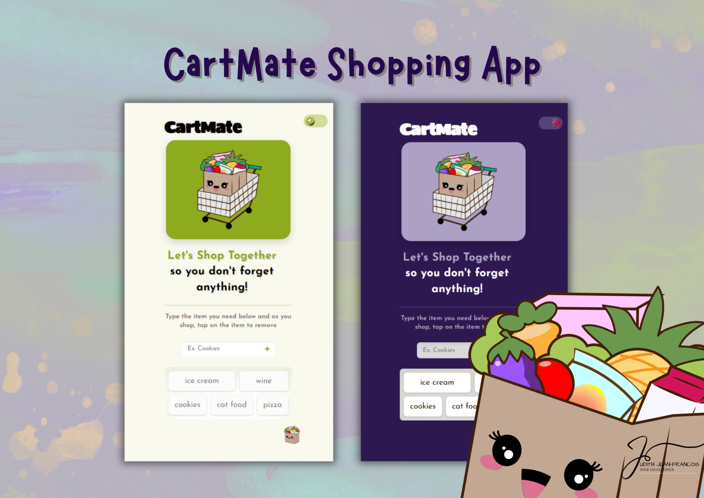

# 🛒 CartMate

CartMate is a playful, accessible grocery list app designed for mobile — letting users easily add and remove items from their list in real-time using Firebase. With a whimsical theme toggle between Kiwi (light mode) and Grape (dark mode), CartMate proves productivity can be adorable.

## Table of contents

- [Overview](#overview)
  - [The challenge](#the-challenge)
  - [Screenshot](#screenshot)
  - [Links](#links)
- [My process](#my-process)
  - [Built with](#built-with)
  - [What I learned](#what-i-learned)
  - [Continued development](#continued-development)
  - [Useful resources](#useful-resources)

## Overview

CartMate is a real-time shopping list app built using HTML, CSS, JavaScript, and Firebase. It allows users to:

### The challenge

- Add grocery items with a simple input field and "+" button

- Remove items by tapping on them

- Experience responsive theming with a custom fruit toggle switch between light and dark mode

- Enjoy accessibility-first design with semantic elements, ARIA labels, skip links, keyboard nav, and passed audits

- Store theme preference in localStorage so their favorite mode persists between sessions

- Use the app easily on mobile (where it shines best!)

### Screenshot

### Links

- Solution URL: https://github.com/Jud1th1/CartMate [https://github.com/Jud1th1/CartMate]
- Live Site URL: https://cartmateshopping.netlify.app/ [https://cartmateshopping.netlify.app/]

## My process

Started with Scrimba’s Firebase tutorial to learn basic CRUD operations in JavaScript using Firebase Realtime Database.

Refactored code to use createElement over innerHTML for better structure and readability.

Replaced onclick-style event handling with addEventListener and swapped the Add button to a proper <form> for accessibility and Enter key support.

Created a custom light/dark mode toggle using fruit-themed SVG icons I illustrated myself 🍑🥝🍇.

Improved accessibility using:

- aria-labels

- skip to main content link

- color contrast checks

- proper label/input associations

Made the theme persist across refreshes using localStorage.

Added animation flourishes (like bouncy fruit and floating logos) for extra charm ✨.

Fully responsive and optimized for mobile screens, but still looks great on desktop!

### Built with

- HTML5 (Semantic)
- CSS3 (Custom properties, Flexbox, Animations)
- JavaScript (ES6+)
- Firebase Realtime Database
- Firebase
- Mobile workflow
- Accessibility-first approach

### What I learned

- How to structure and use a Firebase database

- JavaScript DOM manipulation and best practices

- Styling with CSS variables and creating reusable themes

- Persisting state with localStorage

- Accessibility wins (like form labels, skip links, and semantic elements)

- Debugging async bugs and scope issues

- Staying resilient through bugs, layout shifts, and late-night "why isn't this working" meltdowns 😅

### Continued development

I’d love to:

- Add user authentication (to save individual lists)

- Include categories or emojis for grocery items

- Add drag-and-drop reordering

- Refactor further into a React-based app or turn this into a PWA!

### Useful resources

- [https://scrimba.com/learn/firebase] //Scrimba Tutorial
- [https://console.firebase.google.com/u/0/] //Firebase
- [https://favicon.io] //Favicon convertor
- [https://www.w3schools.com/howto/howto_js_toggle_dark_mode.asp] //Dark/light mode
- [https://codepen.io/Jud1th1/pen/bGmgYRE] //my toggle codepen
- [https://accessibe.com/accessscan] //AccessiBe Audit Tool
